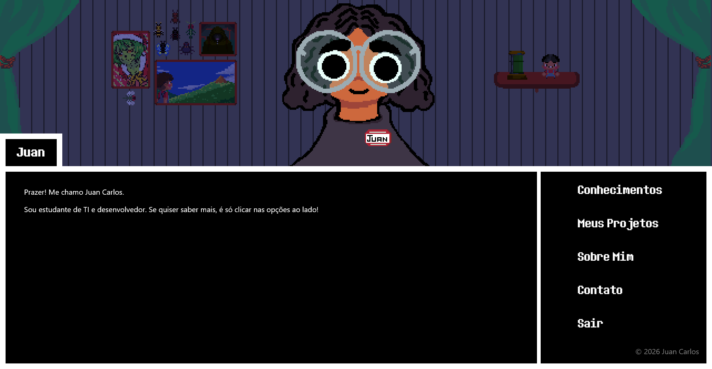
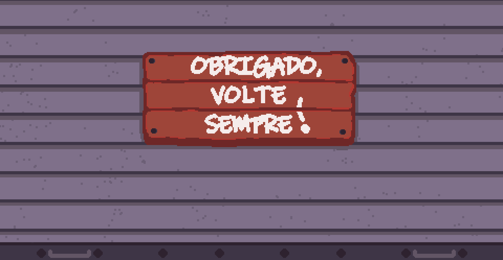

# Gamified Portfolio (RPG Style)


This is an interactive personal portfolio featuring an immersive aesthetic inspired by classic RPGs (like Undertale). The biggest challenge and main highlight of this project is that it was built **100% with pure HTML and CSS**, without a single line of JavaScript.

[**Check out the live portfolio here!**](https://otijolo.github.io/portfolio)

---

## About the Project

Developed to consolidate my Web Development skills, the goal was to push the limits of CSS. All the interactivity, screen transitions, and menu logic were created using advanced CSS techniques.

Beyond the code, the design is completely custom. All the visual elements — from the background scenery to the character and UI details — were drawn and sliced by me using Aseprite.

## Features and Highlights

* **Zero JavaScript:** Tab navigation and menus are controlled purely by HTML states (`input type="radio"` and `:checked`).
* **Typewriter Effect:** Responsive animated dialog texts built with CSS variables, `@keyframes`, and the `steps()` function.
* **Dynamic Eye-Tracking:** The NPC's eyes follow the user's mouse movement across the screen, built entirely with `:hover` selectors.
* **Custom Pixel Art:** All visual assets and sprite slices were made from scratch in Aseprite.

## How to run locally

Since this project is perfectly static and has no dependencies, frameworks, or databases, running it is extremely simple:

1. Clone this repository:
   ```bash
   git clone [https://github.com/otijolo/portfolio.git](https://github.com/otijolo/portfolio.git)
   ```
2. Open the project folder in your file explorer.
3. Double-click the `index.html` file to open it in your default web browser.

## Screenshots




---
Made by [Juan](https://github.com/otijolo)
